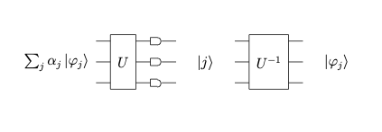
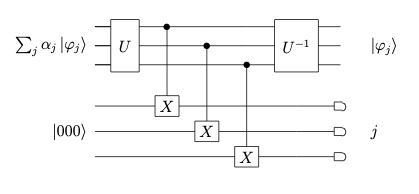
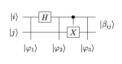
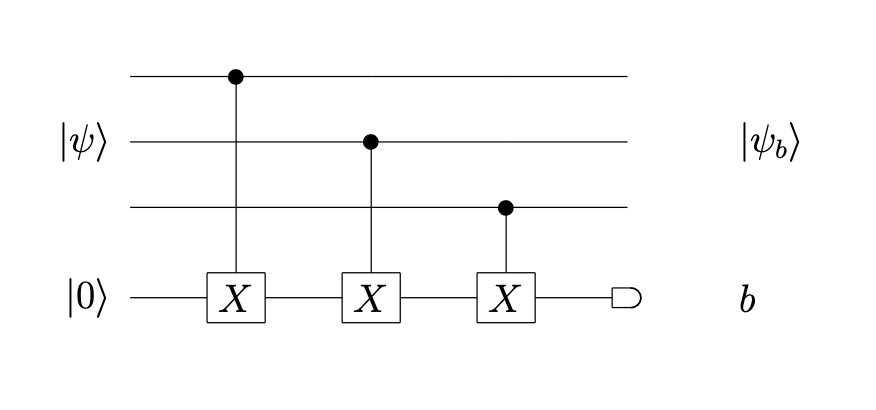

---
jupytext:
  text_representation:
    extension: .md
    format_name: myst
kernelspec:
  display_name: Python 3
  language: python
  name: python3
---

(mediciones_cuanticas)=

# Mediciones con Circuitos Cuanticos
En esta seccion vamos a explorar como podemos utilizar circuitos cuanticos para describir e implementar los diferentes tipos de mediciones cuanticas descritas durante las primeras sesiones del curso. Especificamente, el tipo de mediciones que vamos a explorar es el conjunto de mediciones que se ejecutan con respecto a la base estandar.

Las mediciones proyectivas son muy utilizadas en la computacion y comunicacion cuanticas. En particular, los protocolos de codificacion superdensa y teleportacion cuantica estan basados en mediciones denominadas de *Von Neumann*. Sea un estado $|\Psi>$ que expresado en la base ortonormal $|\psi>$ tiene el desarrollo:

$
|\Psi> = \sum_{j}\alpha_{j}|\psi_{j}>
$

Una **medicion de Von Neumann** de $|\Psi>$ con respecto al conjunto de bases $|\psi>$, descritos por los proyectores ortogonales $\left{|\psi_{j}><\psi_{j}|\right}$ dara como resultado "j" y el estado quedará en el estado $|\psi_{j}>$  con probabilidad $|\alpha_{j}|^{2}$:

$
Tr(|\Psi><\Psi||\psi_{j}><\psi_{j}|) = Tr(<\psi_{j}|\Psi><\Psi|\psi_{j}>)
$

$
= <\psi_{j}|\Psi><\Psi|\psi_{j}>
$

$
|<\psi_{j}|\Psi>|^{2}
$

$
|\alpha_{j}|^{2}
$

Normalmente, un dispositivo fisico es capaz de ejecutar una medicion con respecto a la base estandar en los cubits individuales, pero se puede utilizar un circuito cuantico que registra la medicion de Von Neumann descrita por medio de un registro clasico de cubits multiples. Primero se construye un circuito que realiza la transformacion unitaria:

$
U|\psi> = |j>
$

en esta expresion, el indice *j* se supone en *n-bit* binario (es decir, 0 o 1) y |j> es el estado de la base computacional de *n-cubits* correspondiente a *j*. **Entonces, podemos decir que el operador $U$ hace el cambio de base de la base $|\psi>$ a la base computacional.** Por lo tanto, para un estado arbitrario $\sum_{j}\alpha_{j}|\psi_{j}>$, utilizamos un circuito cuantico para ejecutar el cambio de base mediado por el operador *U* y despues ejecutamos una medicion el registro clasico (en este caso, $|j>$) en la base computacional. Finalmente se aplica el cambio de base inverso, mediado por el operador $U^{-1}$ (reemplazando cada compuerta u operador por su inverso). El circuito completo se muestra en la siguiente figura:

Alternativamente, es posible utilizar una estrategia en la que no se mide el estado intermedio en la base computacional. En cambio, se "copia" la informacion del sistema en el que estamos interesados, a un registro clasico de tipo ancilla y despues ejecutamos una medicion en la base estandar. Esta idea se puede visualizar en el siguiente diagrama:

En este circuito se registran los cubits en los cables inferiores que son medidos luego en la base computacional.

## Ejemplo: Estados de Bell

Como ejemplo de cambio de base *U* vamos a suponer que queremos implementar una medicion de tipo *Von Neumann* en un estado formado por dos cubits, con respecto a la base ortonormal formada por los estados de Bell:

$
|\beta_{00}> = \frac{1}{\sqrt{2}}(|00> + |11>)
$

$
|\beta_{01}> = \frac{1}{\sqrt{2}}(|01> + |10>)
$

$
|\beta_{10}> = \frac{1}{\sqrt{2}}(|00> - |11>)
$

$
|\beta_{11}> = \frac{1}{\sqrt{2}}(|01> - |10>)
$

Esta base se conoce como *base de Bell* y sus estados como estados de Bell (tambien llamados pares EPR). Un circuito que realiza el cambio de base de la base computacional a la de Bell se muestra en la figura siguiente:

Es importante mencionar, que el principio de reversibilidad implica que para hacer un cambio de base de la base de Bell a la base estandar, simplemente basta con ejecutar el circuito del diagrama anterior en orden inverso. Para verificar este algoritmo, supongamos que la entrada al circuito sea el estado de la base computacional $|\psi_{1}>=|00>$. Despues de la compuerta de Hadamard, el estado es:

$
|\psi_{2}>=\frac{1}{\sqrt{2}} (|0> + |1>)|0>
=\frac{1}{\sqrt{2}} (|00> + |01>)
$

Donde hemos sido muy cuidadosos de mantener el orden de los cubits. Despues, la compuerta control-NOT transforma $\psi_{2}$ en el siguiente estado:

$
|\psi_{3}> = \frac{1}{\sqrt{2}} (|00> + |11>)
$

y por lo tanto, tenemos que $|\psi_{3}> = |\beta_{00}>$. De esta manera, verificamos que el circuito ejecuto correctamente el cambio de base en el estado de entrada $|00>$. De manera similar, el mismo circuito ejecuta el cambio de base en los otros tres estados posibles en la base computacional, |01>, |10>, y |11>, transformandolos en $|\beta_{01}>,|\beta_{10}>$ y $|\beta_{11}>$, respectivamente.

## Mediciones proyectivas incompletas

Las mediciones proyectivas incompletas y mas importante, su implementacion, se volvera relevante para los algoritmos de correccion de errores. Como ejemplo de una medicion proyectiva incompleta, exploraremos la medición de paridad. Los proyectores de paridad corresponden a los opearadores $P_{0} = |0><0|$ y $P_{1} = |1><1|$. De esta manera, cualquier estado de entrada, $|\Psi> = \sum_{x}\beta_{x}|x>$ se puede expresar como $|\Psi> = \alpha_{0}|\Psi_{0}>+\alpha_{1}|\Psi_{1}>$, donde

$
\alpha_{i} = \sqrt{<\Psi|P_{i}|\Psi>}
$
 
 y por lo tanto, $|\Psi_{i}> = \frac{P_{i}|\Psi>}{\alpha_{i}}$. De esta manera, una medición de paridad resultará en 0 y el estado $|\Psi_{0}$ con probabilidad $|\alpha_{0}|^{2}$ y el estado $|\Psi_{1}>$ con probabilidad $|\alpha_{1}|^{2}$. Regresando al ejemplo de implementacion de una medición proyectiva, el siguiente circuito calcula la paridad de estados en un sistema de 3-cúbits:

En este diagrama, la medición de cada uno de los 3 cúbits se ejecuta por medio de las compuertas de tipo CNOT, produciendo el estado $|\Psi_{b}>$ como estado de salida con probabilidad $|\alpha_{\beta}|^{2}$ con $b=0,1$. 

